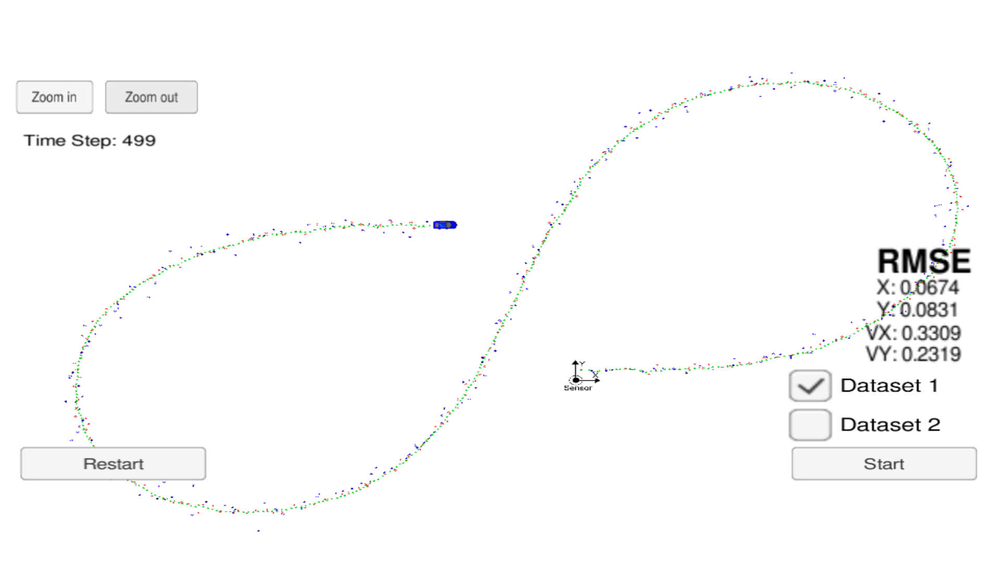

# Unscented Kalman Filter
## Adapted and built for the Self-Driving Car Engineer Nanodegree Program

This is an implementation of an unscented kalman filter for object tracking.
The UKF implements a particle filter, a non-linear measurement model for parsing the polar coordinate data of incoming radar.
In this implementation, the lidar update continues to use an ordinary extended kalman filter algorithm, as it is already linear.
Using another particle filter on lidar would simply be unnecessary overhead.

The algorithm was tested on a Unity-based 2D car simulator, and compared against the ground truth using RMSE.

The algorithm with optimised noise achieves an RMSE as shown in diagram.

### Remarks
An initial attempt to implement the full UKF routine on both lidar and radar resulted in an unusually high RMSE.
I am unsure why this occurs. Mathematically, the result of both should be the same for the linear lidar.
In any case, I reverted the lidar routine as described in the EKF, which allowed for much better performance.

---

## Other Important Dependencies
* cmake >= 3.5
  * All OSes: [click here for installation instructions](https://cmake.org/install/)
* make >= 4.1 (Linux, Mac), 3.81 (Windows)
  * Linux: make is installed by default on most Linux distros
  * Mac: [install Xcode command line tools to get make](https://developer.apple.com/xcode/features/)
  * Windows: [Click here for installation instructions](http://gnuwin32.sourceforge.net/packages/make.htm)
* gcc/g++ >= 5.4
  * Linux: gcc / g++ is installed by default on most Linux distros
  * Mac: same deal as make - [install Xcode command line tools](https://developer.apple.com/xcode/features/)
  * Windows: recommend using [MinGW](http://www.mingw.org/)

## Basic Build Instructions

1. Clone this repo.
2. Make a build directory: `mkdir build && cd build`
3. Compile: `cmake .. && make`
4. Run it: `./UnscentedKF` Previous versions use i/o from text files.  The current state uses i/o
from the simulator.